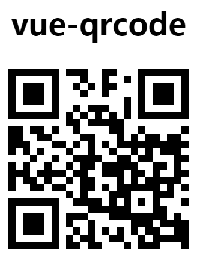

## vue-qrcode

### Install

```bash
npm install vue-qrcode2 -S

yarn add vue-qrcode2
```

### QuickStart
```javascript
require('vue-qrcode/dist/vue-qrcode.css');

// in ES6 modules
import qrcode from 'vue-qrcode';

// in CommonJS
const qrcode = require('vue-qrcode');

// in Global variable
const qrcode = VueQrcode.default;

Vue.use(qrcode);
```
```html
<qrcode :value="qrCode" :size="300"/>
```

### Params

#### props
- `background`: Background color of the QR code
- `backgroundAlpha`: Background alpha of the QR code
- `foreground`: Foreground color of the QR code
- `foregroundAlpha`: Foreground alpha of the QR code
- `level`: Error correction level of the QR code (L, M, Q, H)
- `mime`: MIME type used to render the image for the QR code	
- `padding`: Padding for the QR code (pixels)
- `size`: Size of the QR code (pixels)
- `value`: Value encoded within the QR code

You may use all of [these](https://github.com/neocotic/qrious#api) props to change the format of your QR code.

### Preview

